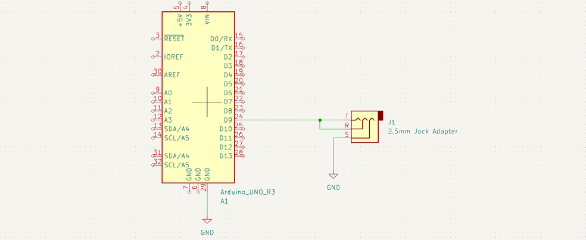

This package was created as a part of this project to help control the camera.

# Quickstart
1. Install pyfirmata and the Arduino IDE
    *  `pip install pyfirmata`
    * Arduino IDE can be found [here](https://www.arduino.cc/en/software)

2. Upload the `StandardFirmata` sketch onto the Arduino
    * In the IDE Library Manager, search `Firmata` and install
    * Under File > Examples > Firmata, select `StandardFirmata`
    * Select the port that the Arduino is connected to
    * Upload sketch

3. Update `config/camera.yaml`
    * The port can be found through the Arduino IDE
    * The pin corresponds to the pin on the Arduino that is connected to the camera

4. The node should be ready to run once you build

# Hardware Used
* Arduino Uno
* Sony a6400 DSLR Camera
* Sony Multi Terminal to 2.5mm adapter
* 2.5mm Breakout

# Software Tested On
* Ubuntu 22.04
* ROS2 Iron
* pyfirmata (v1.1)

# Electrical Setup
On the Sony a6400, the shutter is controlled by shorting the tip, ring, and sleeve on the 2.5mm adapter. A simple way to control this is by connecting the sleeve to ground, and both the tip and sleeve to a digital IO port. When the IO port is pulled low, the shutter starts. When the IO port is pulled high, the shutter is released.

# Multiple service calls
I added a counter that keeps track of how many times the `/start_shutter` service is called. The same number of `/stop_shutter` calls are needed to actually stop the camera shutter. For example, when running `light_paint_three.launch.py`, each drone's corresponding node will call `/start_shutter` once, for a total of three times. The camera shutter won't actually stop until all three nodes call `/stop_shutter`. This ensures that each drone can finish its path during the shutter